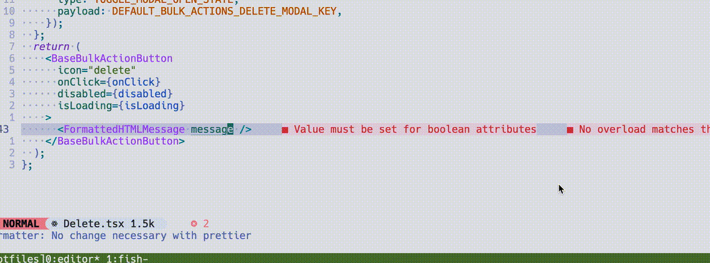

# bobrown101/nvim_cmp_hs_translation_source

A completion source for nvim-cmp that will autocomplete translation keys in the current git project




## Install
Packer
```lua
use {
    'bobrown101/nvim_cmp_hs_translation_source',
    config = function()
        require('nvim_cmp_hs_translation_source').setup()
    end
}

```

## Dependencies
System dependencies
```bash
# ripgrep for fast filesystem searching of lyaml files
# yp for parsing of lyaml files 

brew install rg yq
```
Neovim Dependencies
```lua
-- plenary for 
use {'nvim-lua/plenary.nvim'}
```

## Use
```lua
-- within your nvim-cmp config
    sources = {
        {name = "nvim_cmp_hs_translation_source"}, 
        ...other sources
    },
    --formatting is totally optional, but setting this up will explicitly let you know a completion is a translation key as opposed to just a word found in your buffer
    formatting = {
        format = function(entry, vim_item)
            vim_item.menu = ({
                nvim_cmp_hs_translation_source = "[Translation]",
                -- other examples may look like
                --buffer = "[Buffer]",
                --nvim_lsp = "[LSP]",
                --luasnip = "[LuaSnip]",
                --nvim_lua = "[Lua]",
                --latex_symbols = "[Latex]",
            })[entry.source.name]
            return vim_item
        end
    }
```
